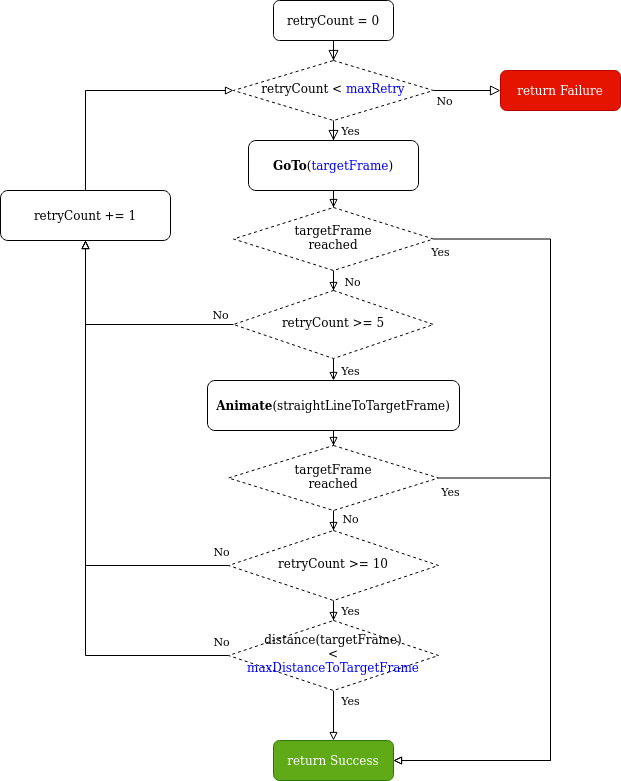

# Pepper Extras

This Android library is a companion library that contains a collection of classes useful when developing Pepper apps.
You will find this library reused in several of the projects we publish in the [Github of SoftBank Robotics Labs](https://github.com/softbankrobotics-labs/).

<!--ts-->
   * [1. Using the library in your project](#1-using-the-library-in-your-project)
      * [1.1. Add the library as a dependency](#11-add-the-library-as-a-dependency)
   * [2. A foreword about synchronous and asynchronous functions](#2-a-foreword-about-synchronous-and-asynchronous-functions)
   * [3. Actions](#3-actions)
      * [3.1. `ExtraLookAt`](#31-extralookat)
         * [3.1.1. Goal](#311-goal)
         * [3.1.2. Typical usage](#312-typical-usage)
         * [3.1.3. Examples](#313-examples)
            * [3.1.3.1. Automatically terminate an `ExtraLookAt` when Pepper is looking at the target](#3131-automatically-terminate-an-extralookat-when-pepper-is-looking-at-the-target)
            * [3.1.3.2. Display `ExtraLookAt` states in the log](#3132-display-extralookat-states-in-the-log)
         * [3.1.4. How to use it](#314-how-to-use-it)
            * [3.1.4.1. Setting the movement policy](#3141-setting-the-movement-policy)
            * [3.1.4.2. Termination policies](#3142-termination-policies)
            * [3.1.4.3. States changes triggering](#3143-states-changes-triggering)
      * [3.2. `StubbornGoTo`](#32-stubborngoto)
         * [3.2.1. Goal](#321-goal)
         * [3.2.2. Typical usage](#322-typical-usage)
         * [3.2.3. Example](#323-example)
         * [3.2.4. How it works](#324-how-it-works)
         * [3.2.5. Tuning `StubbornGoTo` behavior](#325-tuning-stubborngoto-behavior)
            * [3.2.5.1. Final Orientation Policy](#3251-final-orientation-policy)
            * [3.2.5.2. Maximum Navigation Speed](#3252-maximum-navigation-speed)
            * [3.2.5.3. Maximum Retries](#3253-maximum-retries)
            * [3.2.5.4. Maximum Distance To Target Frame](#3254-maximum-distance-to-target-frame)
            * [3.2.5.5. Walking Animation](#3255-walking-animation)
   * [4. Widgets](#4-widgets)
      * [4.1. `ExplorationMapView`](#41-explorationmapview)
         * [4.1.1. Goal](#411-goal)
         * [4.1.2. Typical usage](#412-typical-usage)
         * [4.1.3. How to use it](#413-how-to-use-it)
   * [5. Geometry Helpers](#5-geometry-helpers)
      * [5.1. Geometry computations on `Frame`, `Transform`, `Vector3` and `Quaternion`.](#51-geometry-computations-on-frame-transform-vector3-and-quaternion)
         * [5.1.1. Goal](#511-goal)
         * [5.1.2. How to use it](#512-how-to-use-it)
            * [5.1.2.1. Compute the translation and distance between two `Frame`s](#5121-compute-the-translation-and-distance-between-two-frames)
            * [5.1.2.2. Multiply, Inverse `Transform`](#5122-multiply-inverse-transform)
            * [5.1.2.3. Add, subtract, multiply `Quaternion`](#5123-add-subtract-multiply-quaternion)
            * [5.1.2.4. Convert `Quaternion` to Apache Commons Math `Quaternion` and `Rotation`](#5124-convert-quaternion-to-apache-commons-math-quaternion-and-rotation)
            * [5.1.2.5. Add, subtract, multiply, divide `Vector3`](#5125-add-subtract-multiply-divide-vector3)
            * [5.1.2.6. Convert `Vector3` to Apache Commons `Vector3D`](#5126-convert-vector3-to-apache-commons-vector3d)
      * [5.2. Detached `Frame`s](#52-detached-frames)
         * [5.2.1. Goal](#521-goal)
         * [5.2.2. Typical usage](#522-typical-usage)
         * [5.2.3. How to use it](#523-how-to-use-it)
         * [5.2.4. Example](#524-example)
      * [5.3. Retrieving a `Frame` at a certain timestamp](#53-retrieving-a-frame-at-a-certain-timestamp)
         * [5.3.1. Goal](#531-goal)
         * [5.3.2. Typical usage](#532-typical-usage)
         * [5.3.3. How to use it](#533-how-to-use-it)
         * [5.3.4. Example](#534-example)
      * [5.4. Coordinates conversions between `mapFrame` and `MapTopGraphicalRepresentation`](#54-coordinates-conversions-between-mapframe-and-maptopgraphicalrepresentation)
         * [5.4.1. Goal](#541-goal)
         * [5.4.2. How to use it](#542-how-to-use-it)
         * [5.4.3. Example](#543-example)
   * [6. Other Helpers](#6-other-helpers)
      * [6.1. Generic Logging `TAG`](#61-generic-logging-tag)
         * [6.1.1. Goal](#611-goal)
         * [6.1.2. How to use it](#612-how-to-use-it)
         * [6.1.3. Example](#613-example)
      * [6.2. Convert `EncodedImage` to `Bitmap`](#62-convert-encodedimage-to-bitmap)
         * [6.2.1. Goal](#621-goal)
         * [6.2.2. How to use it](#622-how-to-use-it)
         * [6.2.3. Examples](#623-examples)
   * [7. Integration with Kotlin Coroutines](#7-integration-with-kotlin-coroutines)
      * [7.1. What are Kotlin Coroutines](#71-what-are-kotlin-coroutines)
      * [7.2. `Future.await` and `Future.awaitOrNull`](#72-futureawait-and-futureawaitornull)
         * [7.2.1. Goal](#721-goal)
         * [7.2.2. How to use it](#722-how-to-use-it)
         * [7.2.3. Example](#723-example)
      * [7.3. `CoroutineScope.asyncFuture`](#73-coroutinescopeasyncfuture)
         * [7.3.1. Goal](#731-goal)
         * [7.3.2. How to use it](#732-how-to-use-it)
         * [7.3.3. Example](#733-example)
      * [7.4. Solving synchronisation issues using single thread confinement and coroutines](#74-solving-synchronisation-issues-using-single-thread-confinement-and-coroutines)
         * [7.4.1. Goal](#741-goal)
         * [7.4.2. How to use it](#742-how-to-use-it)
         * [7.4.3. Example](#743-example)
   * [8. Testing Pepper QiSDK apps](#8-testing-pepper-qisdk-apps)
      * [8.1. Getting robot focus in instrumented tests: `withRobotFocus`](#81-getting-robot-focus-in-instrumented-tests:-withrobotfocus)
         * [8.1.1. Goal](#811-goal)
         * [8.1.2. How to use it](#812-how-to-use-it)
   * [9. License](#9-license)
<!--te-->

## 1. Using the library in your project


### 1.1. Add the library as a dependency

[Follow these instructions](https://jitpack.io/#softbankrobotics-labs/pepper-extras)

Make sure to replace 'Tag' by the number of the version of the library you want to use, or by 'master-SNAPSHOT' to use the master branch.


## 2. A foreword about synchronous and asynchronous functions

Most of the QiSDK APIs exist in two versions: synchronous and asynchronous versions.

Here is the synchronous version:

```Kotlin
val say: Say = SayBuilder.with(qiContext).withText("Hello world!").build()
say.run()
// ... do something after the say has run
```

And here the asynchronous version:

```Kotlin
val sayFuture: Future<Say> = SayBuilder.with(qiContext).withText("Hello world!").buildAsync()
val sayActionFuture: Future<Void> = sayFuture.andThenCompose { say -> say.async().run() }
sayActionFuture.andThenConsume {
    // ... do something after the say has run
}
```

The synchronous version are nicer to write and read, but they will block the execution on the thread they run. The asynchronous version look verbose, but they will not block the current thread, which is a much better behavior in a multithreaded application.

All the actions/functions that are provided by PepperExtras exists in both versions. Synchronous and asynchronous. However for the sake of simplicity and readability, we chose to present only the synchronous version in this README.

But remember both exists! As in `qiContext.actuation.makeDetachedFrame` and `qiContext.actuation.async().makeDetachedFrame`, or `StubbornGoToBuilder.with(qiContext).withFrame(frame).build()` and `StubbornGoToBuilder.with(qiContext).withFrame(frame).buildAsync()`, etc...

Moreover, as a general rule, when you write a Pepper application, it is usually better to use the asynchronous version. For a better experience we encourage you to use coroutines and look at the helpers we provide in section [6. Integration with Kotlin Coroutines](#6-integration-with-kotlin-coroutines).


***

## 3. Actions

### 3.1. `ExtraLookAt`

#### 3.1.1. Goal

`ExtraLookAt` makes Pepper look at a specific location with his head and optionally his mobile base.

Compared to a standard [`LookAt`](https://developer.softbankrobotics.com/pepper-qisdk/api/motion/reference/lookat) il also provides:

* States: `ExtraLookAt` tells you when Pepper is looking or not
* Termination policies: you can request `ExtraLookAt` to terminate once it's looking at the target

#### 3.1.2. Typical usage

Use `ExtraLookAt` instead of [`LookAt`](https://developer.softbankrobotics.com/pepper-qisdk/api/motion/reference/lookat) when:

* you want Pepper to look at something/someone, then automatically stop the [`LookAt`](https://developer.softbankrobotics.com/pepper-qisdk/api/motion/reference/lookat).
* you want Pepper to look at something/someone, and be told when Pepper is actually looking at it or not.

#### 3.1.3. Examples

##### 3.1.3.1. Automatically terminate an `ExtraLookAt` when Pepper is looking at the target

```Kotlin
// Compute a target frame to look at.
// We create a frame 5 meters front of Pepper, 2 meters on its left
val targetFrame: Frame = qiContext.mapping.makeFreeFrame().apply {
    update(qiContext.actuation.robotFrame(),
        TransformBuilder.create().from2DTranslation(5.0, 2.0), 0)
}.frame()

// Build the action.
val extraLookAt: ExtraLookAt = ExtraLookAtBuilder.with(qiContext)
    .withFrame(targetFrame)
    .withTerminationPolicy(ExtraLookAt.TerminationPolicy.TERMINATE_WHEN_LOOKING_AT_OR_NOT_MOVING_ANYMORE)
    .build().apply {
        policy = LookAtMovementPolicy.HEAD_ONLY
    }

// Run the action synchronously, it terminates once Pepper is looking at, or if it can't
// look at and does not move anymore.
extraLookAt.run()

// extraLookAt does not run anymore.

// If BackgroundMovement or BasicAwareness are not held, Pepper head will come back to
// neutral position, or to where BasicAwareness was looking at.
// Hold BackgroundMovement and BasicAwareness if you want Pepper head stays where
// extraLookAt put it.
```

##### 3.1.3.2. Display `ExtraLookAt` states in the log

```Kotlin
val transformOnTheLeft = TransformBuilder.create().from2DTranslation(5.0, 2.0)
val transformOnTheRight = TransformBuilder.create().from2DTranslation(5.0, -2.0)
val robotFrame = qiContext.actuation.robotFrame()

// Create a FreeFrame
val targetFreeFrame: FreeFrame = qiContext.mapping.makeFreeFrame()

// Put it 5 meters front of Pepper, 2 meters on its left
targetFreeFrame.update(robotFrame, transformOnTheLeft, 0)

// Build the action.
val extraLookAt: ExtraLookAt = ExtraLookAtBuilder.with(qiContext)
    .withFrame(targetFreeFrame.frame())
    .withTerminationPolicy(ExtraLookAt.TerminationPolicy.RUN_FOREVER)
    .build().apply {
        policy = LookAtMovementPolicy.HEAD_ONLY
    }.apply {
        addOnStatusChangedListener(object: ExtraLookAt.OnStatusChangedListener {
            override fun onStatusChanged(status: ExtraLookAt.LookAtStatus) {
                Log.i("ExampleExtraLookAt", "ExtraLookAt status changes to: $status")
            }
        })
    }

// Run the action asynchronously
Log.i("ExampleExtraLookAt", "Starting")
val extraLookAtFuture: Future<Void> = extraLookAt.async().run()

// Wait 3 seconds
SystemClock.sleep(3000)

// Now put the target frame on the right of Pepper
Log.i("ExampleExtraLookAt", "Changing the target to the right")
targetFreeFrame.update(robotFrame, transformOnTheRight, 0)

// Wait 3 seconds
SystemClock.sleep(3000)

// Stop the ExtraLookAt
extraLookAtFuture.requestCancellation()
```

Most of the time, this example displays:

```
00:00.000 I/ExampleExtraLookAt: Starting
00:00.236 I/ExampleExtraLookAt: ExtraLookAt status changes to: NOT_LOOKING_AT
00:00.966 I/ExampleExtraLookAt: ExtraLookAt status changes to: LOOKING_AT
00:03.002 I/ExampleExtraLookAt: Changing the target to the right
00:03.691 I/ExampleExtraLookAt: ExtraLookAt status changes to: NOT_LOOKING_AT
00:04.395 I/ExampleExtraLookAt: ExtraLookAt status changes to: LOOKING_AT
```

The `ExtraLookAt` goes through:

* `NOT_LOOKING_AT`: since the robot is first looking straight, and started moving
* `LOOKING_AT`: Pepper is now looking at the frame with its head

Then we change the target frame, and it goes again through

* `NOT_LOOKING_AT`: since the robot is looking at the old target frame, not the new one, and started moving toward the new target
* `LOOKING_AT`: Pepper is now looking at the new target frame with its head


However, if you run this example several time, you will see that it does not *always* display the same output.

Indeed you may also have this:

```
00:00.000 I/ExampleExtraLookAt: Starting
00:00.209 I/ExampleExtraLookAt: ExtraLookAt status changes to: NOT_LOOKING_AT
00:00.852 I/ExampleExtraLookAt: ExtraLookAt status changes to: LOOKING_AT
00:03.002 I/ExampleExtraLookAt: Changing the target to the right
00:03.416 I/ExampleExtraLookAt: ExtraLookAt status changes to: NOT_LOOKING_AT_AND_NOT_MOVING_ANYMORE
00:04.035 I/ExampleExtraLookAt: ExtraLookAt status changes to: NOT_LOOKING_AT
00:04.650 I/ExampleExtraLookAt: ExtraLookAt status changes to: LOOKING_AT
```

Here we get an extra step: `NOT_LOOKING_AT_AND_NOT_MOVING_ANYMORE`, just after we changed the target.
This is due to the fact that Pepper did not start moving the head right away toward the new target frame when we changed it. Then `ExtraLookAt` detected it. Then Pepper started moving the head, and `ExtraLookAt` went to `NOT_LOOKING_AT`.


You can even have this:

```
00:00.000 I/ExampleExtraLookAt: Starting
00:00.217 I/ExampleExtraLookAt: ExtraLookAt status changes to: NOT_LOOKING_AT
00:00.854 I/ExampleExtraLookAt: ExtraLookAt status changes to: LOOKING_AT
00:01.431 I/ExampleExtraLookAt: ExtraLookAt status changes to: NOT_LOOKING_AT_AND_NOT_MOVING_ANYMORE
00:03.002 I/ExampleExtraLookAt: Changing the target to the right
00:03.980 I/ExampleExtraLookAt: ExtraLookAt status changes to: NOT_LOOKING_AT
00:04.622 I/ExampleExtraLookAt: ExtraLookAt status changes to: LOOKING_AT
```

Here, Pepper head was looking at the target at 00.854, but then it moved its head a little bit after 1 second 443, possibly because of [`BackgroundMovements`](https://developer.softbankrobotics.com/pepper-qisdk/api/autonomous-abilities/reference/backgroundmovement), and is not really looking straight at the target anymore. The `ExtraLookAt` noticed it and went to `NOT_LOOKING_AT_AND_NOT_MOVING_ANYMORE`.

***

**Important**

All this shows that you have to be **very careful** when using states with `ExtraLookAt`, as it may not always do what you expect it to. Indeed `ExtraLookAt` only monitors the looking state of the robot, and does not really orientate the robot itself. This is done under the hood by a QiSDK [`LookAt`](https://developer.softbankrobotics.com/pepper-qisdk/api/motion/reference/lookat) action.
To know more about `ExtraLookAt` states changes, read the next section [2.1.4.2 States changes triggering](#2142-states-changes-triggering).

***

#### 3.1.4. How to use it


##### 3.1.4.1. Setting the movement policy

Similarly to [`LookAt`](https://developer.softbankrobotics.com/pepper-qisdk/api/motion/reference/lookat), when Pepper looks at a location, you can choose if he should use only his head or also move his mobile base by setting the `LookAtMovementPolicy`.

By default, the `LookAtMovementPolicy` is set to `HEAD_AND_BASE`, but it can be set to `HEAD_ONLY`.

If you choose `HEAD_ONLY`, Pepper will only turn his head to look at the specified Frame. However, if you use `HEAD_AND_BASE`, Pepper will be able to also turn his base.

##### 3.1.4.2. Termination policies

`ExtraLookAt` can either run indefinitely, or stops when its looking at the target. There are three possible termination policies:

* `ExtraLookAt.TerminationPolicy.RUN_FOREVER`

The `ExtraLookAt` will behave like a regular [`LookAt`](https://developer.softbankrobotics.com/pepper-qisdk/api/motion/reference/lookat), and will run forever until you cancel it.

* `ExtraLookAt.TerminationPolicy.TERMINATE_WHEN_LOOKING`

The `ExtraLookAt` will terminate if it succeed in looking at the target. If it get stuck and can't look at the target, it will run forever. If you want `ExtraLookAt` to finish also in that case, use the next policy.

* `ExtraLookAt.TerminationPolicy.TERMINATE_WHEN_LOOKING_AT_OR_NOT_MOVING_ANYMORE`

The `ExtraLookAt` will terminate if it succeed in looking at the target, or if it can't look at the target.

##### 3.1.4.3. States changes triggering

ExtraLookAt is constantly monitoring Pepper, to determine if its looking or not at the target frame.
You can know when the states changes, by setting a listener with `ExtraLookAt.addOnStatusChangedListener`:

```Kotlin
val extraLookAt: ExtraLookAt = ExtraLookAtBuilder.with(qiContext)
    .withFrame(targetFrame)
    .withTerminationPolicy(ExtraLookAt.TerminationPolicy.RUN_FOREVER)
    .build().apply {
        policy = LookAtMovementPolicy.HEAD_ONLY
    }.apply {
        addOnStatusChangedListener(object: ExtraLookAt.OnStatusChangedListener {
            override fun onStatusChanged(status: ExtraLookAt.LookAtStatus) {
                Log.i("ExtraLookAt", "ExtraLookAt status changes to: $status")
            }
        })
    }
```

Below we summarize when state changes occurs.

* When `ExtraLookAt` policy is started with [`LookAtMovementPolicy.HEAD_ONLY`](https://developer.softbankrobotics.com/pepper-qisdk/apidoc/javadoc/qisdk/com.aldebaran.qi.sdk.object.actuation/-look-at-movement-policy/index.html)

| State                                 | What triggers it           |
| ------------------------------------- | ---------------------------|
| `NOT_STARTED`                           | start state, when `ExtraLookAt` is not started                                                                                                                                                                                                                                                                                                                                                                                                                                                                                                                                                                                                                                                                          |
| `NOT_LOOKING_AT`                        | triggers when Pepper body or head is turning, and [Pepper Gaze Frame](https://developer.softbankrobotics.com/pepper-qisdk/api/motion/reference/frame#gaze-frame) is not aligned with the target                                                                                                                                                                                                                                                                                                                                                                                                                                                                                                                       |
| `LOOKING_AT`                            |                                                                                                                                                                                                triggers when [Pepper Gaze Frame](https://developer.softbankrobotics.com/pepper-qisdk/api/motion/reference/frame#gaze-frame) is aligned with the target, with an error margin of 1 radian                                                                                                                                                                                                                                                                                                                              |
| `NOT_LOOKING_AT_AND_NOT_MOVING_ANYMORE` |                                                                                                                                                                                                                                                                                                                                                                                        triggers when Pepper body and head are not moving at all, and [Pepper Gaze Frame](https://developer.softbankrobotics.com/pepper-qisdk/api/motion/reference/frame#gaze-frame) or [Pepper Body Frame](https://developer.softbankrobotics.com/pepper-qisdk/api/motion/reference/frame#robot-frame) are not aligned with the target|

* When `ExtraLookAt` policy is started with [`LookAtMovementPolicy.HEAD_AND_BASE`](https://developer.softbankrobotics.com/pepper-qisdk/apidoc/javadoc/qisdk/com.aldebaran.qi.sdk.object.actuation/-look-at-movement-policy/index.html)


| State                                 | What triggers it           |
| ------------------------------------- | ---------------------------|
| `NOT_STARTED`| start state, when ExtraLookAt is not started |
| `NOT_LOOKING_AT` | triggers when Pepper body or head is turning, and [Pepper Gaze Frame](https://developer.softbankrobotics.com/pepper-qisdk/api/motion/reference/frame#gaze-frame) as well as [Pepper Body Frame](https://developer.softbankrobotics.com/pepper-qisdk/api/motion/reference/frame#robot-frame) are not aligned with the target |
| `LOOKING_AT` | triggers when [Pepper Gaze Frame](https://developer.softbankrobotics.com/pepper-qisdk/api/motion/reference/frame#gaze-frame) and [Pepper Body Frame](https://developer.softbankrobotics.com/pepper-qisdk/api/motion/reference/frame#robot-frame) are both aligned with the target, with an error margin of 1 radian |
| `NOT_LOOKING_AT_AND_NOT_MOVING_ANYMORE` | triggers when Pepper body and head are not moving at all, and [Pepper Gaze Frame](https://developer.softbankrobotics.com/pepper-qisdk/api/motion/reference/frame#gaze-frame) or [Pepper Body Frame](https://developer.softbankrobotics.com/pepper-qisdk/api/motion/reference/frame#robot-frame) are not aligned with the target |


It is possible to reset the `ExtraLookAt` state to `NOT_STARTED`. This can be useful if you manually update the target frame and want to make sure a state change will be triggered after your update. In that case use `ExtraLookAt.resetStatus()`:

```Kotlin
// Create a freeFrame
val targetFreeFrame: FreeFrame = qiContext.mapping.makeFreeFrame()

// Update it to some value
...

// Create the ExtraLookAt, set the targetFreeFrame as the target
val extraLookAt: ExtraLookAt = ..

// run it
val extraLookAtFuture: Future<Void> = extraLookAt.async().run()

// Update the target frame
targetFreeFrame.update(...)

// Immediately reset the ExtraLookAt
extraLookAt.resetStatus()

// Now you are sure a state change will be triggered, whatever the state was before you did the targetFreeFrame update
```


### 3.2. `StubbornGoTo`

#### 3.2.1. Goal

Make Pepper go somewhere. Really.

Compared to a standard [`GoTo`](https://developer.softbankrobotics.com/pepper-qisdk/api/motion/reference/goto):

* `StubbornGoTo` will try harder to go somewhere. Its success rate for reaching a location is much higher than a [`GoTo`](https://developer.softbankrobotics.com/pepper-qisdk/api/motion/reference/goto).
* `StubbornGoTo` also optionally animate Pepper arms while going somewhere.

#### 3.2.2. Typical usage

Use `StubbornGoTo` instead of [`GoTo`](https://developer.softbankrobotics.com/pepper-qisdk/api/motion/reference/goto) when:

* you want Pepper to try as hard as possible to go somewhere, and be sure that if it fails, its just that the place was really unreachable.

#### 3.2.3. Example

```Kotlin
// Create a Frame 2 meters in front of the robot
val frame2MeterInFront = qiContext.mapping.makeFreeFrame(). apply {
    update(qiContext.actuation.robotFrame(),
        TransformBuilder.create().fromXTranslation(2.0), 0)
}.frame()

// Create the StubbornGoTo action
val goto = StubbornGoToBuilder.with(qiContext)
    .withFinalOrientationPolicy(OrientationPolicy.ALIGN_X)
    .withMaxRetry(10)
    .withMaxSpeed(0.5f)
    .withMaxDistanceFromTargetFrame(0.3)
    .withWalkingAnimationEnabled(true)
    .withFrame(frame2MeterInFront).build()

// And run int
goto.run()
```

#### 3.2.4. How it works

Under the hood, `StubbornGoTo` combine a [`GoTo`](https://developer.softbankrobotics.com/pepper-qisdk/api/motion/reference/goto) action with and [`Animate`](https://developer.softbankrobotics.com/pepper-qisdk/api/motion/reference/animate) action. The algorithm for `StubbornGoTo` is quite simple: it will start by retrying a regular [`GoTo`](https://developer.softbankrobotics.com/pepper-qisdk/api/motion/reference/goto) 5 times, than it will retry [`GoTo`](https://developer.softbankrobotics.com/pepper-qisdk/api/motion/reference/goto) followed by [`Animate`](https://developer.softbankrobotics.com/pepper-qisdk/api/motion/reference/animate), using an generated animation consisting of a straight line to the target. After 10 retry, it will stop if it has not reached the target but is close enough. You can see the algorithm summarized in the following flowchart:



The variable enlightened in blue are configurable using the `StubbornGoToBuilder`.

#### 3.2.5. Tuning `StubbornGoTo` behavior


##### 3.2.5.1. Final Orientation Policy

Options are:

* [`FREE_ORIENTATION`](https://developer.softbankrobotics.com/pepper-qisdk/apidoc/javadoc/qisdk/com.aldebaran.qi.sdk.object.actuation/-orientation-policy/index.html) policy (default): the `StubbornGoTo` does not control the robot final orientation, it will only try to reach the target frame 2D position.
* [`ALIGN_X`](https://developer.softbankrobotics.com/pepper-qisdk/apidoc/javadoc/qisdk/com.aldebaran.qi.sdk.object.actuation/-orientation-policy/index.html) policy: the `StubbornGoTo` finishes by aligning the robot frame X-Axis with the target frame X-Axis.

##### 3.2.5.2. Maximum Navigation Speed

One can specify a maximum navigating speed in m/s. There is no guarantee that the robot will reach that speed, only that it will not go faster than the specified maximum speed. By default, the robot will not go faster than 0.35 m/s.

##### 3.2.5.3. Maximum Retries

You can change the number of time `StubbornGoTo` will retry to go somewhere. By default it retry 10 times.

##### 3.2.5.4. Maximum Distance To Target Frame

After 10 retries, `StubbornGoTo` considers it succeeded if it is close enough to the target frame. By default it uses a 30 cm threshold.

##### 3.2.5.5. Walking Animation

Enable this parameter if you want the `StubbornGoTo` to animate Pepper's arms while it is moving. The animation consists of swinging Pepper's hands.


## 4. Widgets

### 4.1. `ExplorationMapView`

#### 4.1.1. Goal

Display an [`ExplorationMap`](https://developer.softbankrobotics.com/pepper-qisdk/api/motion/reference/explorationmap) on Pepper tablet. Display the position of Pepper in the map.

#### 4.1.2. Typical usage

Use `ExplorationMapView` to debug your Localize & Mapping application.

#### 4.1.3. How to use it

Add the `ExplorationMapView` to your application layout

```Xml
<?xml version="1.0" encoding="utf-8"?>
<androidx.constraintlayout.widget.ConstraintLayout xmlns:android="http://schemas.android.com/apk/res/android"
    xmlns:app="http://schemas.android.com/apk/res-auto"
    xmlns:tools="http://schemas.android.com/tools"
    android:layout_width="match_parent"
    android:layout_height="match_parent"
    tools:context=".MainActivity">

    <com.softbankrobotics.dx.pepperextras.ui.ExplorationMapView
        android:id="@+id/explorationMapView"
        android:layout_width="match_parent"
        android:layout_height="match_parent"
        />

</androidx.constraintlayout.widget.ConstraintLayout>
```

Then in your main activity, create an [`ExplorationMap`](https://developer.softbankrobotics.com/pepper-qisdk/api/motion/reference/explorationmap).
For instance to create a minimal [`ExplorationMap`](https://developer.softbankrobotics.com/pepper-qisdk/api/motion/reference/explorationmap), use:

```Kotlin
var localizeAndMapFuture: Future<Void>? = null

// Create a localize and map
val localizeAndMap = LocalizeAndMapBuilder.with(qiContext).build()

// Stop it once the robot is localized
localizeAndMap.addOnStatusChangedListener {
    if (it == LocalizationStatus.LOCALIZED) {
        localizeAndMapFuture?.requestCancellation()
    }
}

// Run the action asynchronously to get a future
localizeAndMapFuture = localizeAndMap.async().run()

// Wait for the future to be cancelled (it will be cancelled in the listener once the robot
// is LOCALIZED)
try {
    localizeAndMapFuture.get()
} catch (e: CancellationException) {

}

// Retrieve the explorationMap
val explorationMap = localizeAndMap.dumpMap()
```

Once the map is created, you can give it to the `ExplorationMapView` widget so that it gets displayed

```Kotlin
// Pass the ExplorationMap to the ExplorationMapView, it will get displayed
explorationMapView.setExplorationMap(explorationMap.topGraphicalRepresentation)
```

Optionally, display the robot position in the [`ExplorationMap`](https://developer.softbankrobotics.com/pepper-qisdk/api/motion/reference/explorationmap). To do so, start a `Localize` action, then periodically compute the robot position relatively to the [`mapFrame`](https://developer.softbankrobotics.com/pepper-qisdk/api/motion/reference/frame#map-frame), and call `ExplorationMapView.setRobotPosition`

```Kotlin
// Create a localize
val localize = LocalizeBuilder.with(qiContext).withMap(explorationMap).build()

// Run asynchronously
localize.async().run()

// Retrieve the robot Frame
val robotFrame = qiContext.actuation.robotFrame()

// Retrieve the origin of the map Frame
val mapFrame = qiContext.mapping.mapFrame()
while (true) {
    // Compute the position of the robot relatively to the map Frame
    val robotPos = robotFrame.computeTransform(mapFrame).transform

    // Set the position in the ExplorationMapView widget, it will be displayed as a
    // red circle
    explorationMapView.setRobotPosition(robotPos)

    // Wait a little bit before updating again the robot position
    SystemClock.sleep(500)
}
```

## 5. Geometry Helpers

### 5.1. Geometry computations on `Frame`, `Transform`, `Vector3` and `Quaternion`.

#### 5.1.1. Goal

Many helpers useful when working with [`Frame`](https://developer.softbankrobotics.com/pepper-qisdk/api/motion/reference/frame), [`Transform`](https://developer.softbankrobotics.com/pepper-qisdk/api/motion/reference/transform-transformtime), [`Vector3`](https://developer.softbankrobotics.com/pepper-qisdk/apidoc/javadoc/qisdk/com.aldebaran.qi.sdk.object.geometry/-vector3/index.html) and [`Quaternion`](https://developer.softbankrobotics.com/pepper-qisdk/apidoc/javadoc/qisdk/com.aldebaran.qi.sdk.object.geometry/-quaternion/index.html).

#### 5.1.2. How to use it

Under the hood, we use the [Apache Commons Math library](https://commons.apache.org/proper/commons-math/) to do most of the geometrical operations.

##### 5.1.2.1. Compute the translation and distance between two `Frame`s

This library defines two Kotlin extension functions on [`Frame`](https://developer.softbankrobotics.com/pepper-qisdk/api/motion/reference/frame):

* `fun Frame.computeTranslation(other: Frame): Vector3`: return the translation Vector to [`Frame`](https://developer.softbankrobotics.com/pepper-qisdk/api/motion/reference/frame) other
* `fun Frame.distance(other: Frame): Double`: Return the distance to [`Frame`](https://developer.softbankrobotics.com/pepper-qisdk/api/motion/reference/frame) other

**Example:**

```Kotlin
val robotFrame = qiContext.actuation.robotFrame()
val gazeFrame = qiContext.actuation.gazeFrame()

// Compute the translation and the distance between the robotFrame and the gazeFrame
val distance: Double = robotFrame.distance(gazeFrame)
val translation: Vector3 = robotFrame.computeTranslation(gazeFrame)

// Asynchronous version are available:
val distanceFuture: Future<Double> = robotFrame.async().distance(gazeFrame)
val translationFuture: Future<Vector3> = robotFrame.async().computeTranslation(gazeFrame)
```

##### 5.1.2.2. Multiply, Inverse `Transform`

This library defines two Kotlin extension functions on [`Transform`](https://developer.softbankrobotics.com/pepper-qisdk/api/motion/reference/transform-transformtime):

* `operator fun Transform.times(t2: Transform): Transform`: multiply two [`Transform`](https://developer.softbankrobotics.com/pepper-qisdk/api/motion/reference/transform-transformtime)s
* `fun Transform.inverse(): Transform`: get the inverse of a [`Transform`](https://developer.softbankrobotics.com/pepper-qisdk/api/motion/reference/transform-transformtime)

**Example1:** Getting the inverse

```Kotlin
val robotFrame = qiContext.actuation.robotFrame()
val gazeFrame = qiContext.actuation.gazeFrame()

// Compute the transform from gazeFrame to robotFrame
val gazeToRobot = robotFrame.computeTransform(gazeFrame).transform

// Taking the inverse of that transform, is equivalent to computing the transform between
// robotFrame to gazeFrame:
val robotToGaze1 = gazeToRobot.inverse()
val robotToGaze2 = gazeFrame.computeTransform(robotFrame).transform

// robotToGaze1 and robotToGaze2 are equivalent
```

**Example2:** Using the multiplication operator


```Kotlin
val robotFrame = qiContext.actuation.robotFrame()
val gazeFrame = qiContext.actuation.gazeFrame()

// Multiplying transform is useful to change from coordinate system
// Imagine there is the transform of an object expressed in gazeFrame coordinates,
// with coordinate (1, 3) in gazeFrame (1 meter in front, 3 meters on the left, and Z equal to 0)
val gazeToObject = TransformBuilder.create().from2DTranslation(1.0, 3.0)

// Can we compute the coordinate of that object in robotFrame ?
// Its easy, get the gazeToRobot transform
val gazeToRobot = robotFrame.computeTransform(gazeFrame).transform
// And combine it with the object coordinate (note that the * is in fact the operator extension we defined)
val robotToObject = gazeToRobot.inverse() * gazeToObject

Log.i("Geometry", robotToObject.toString())
```

When you run this example and display `robotToObject`, with Pepper head in neutral position, you obtain:

```
I/Geometry: Transform{
   rotation=Quaternion{ x=-0.004664889327254041, y=-0.06132364776672064, z=-6.906350824668818E-5, w=0.9981070304643583 },
   translation=Vector3{ x=1.029489007236932, y=3.004283461391637, z=1.2122079586874648 }
}
```

Object in [`robotFrame`](https://developer.softbankrobotics.com/pepper-qisdk/api/motion/reference/frame#robot-frame) coordinate, is 1 meter in front, 3 meters on the left, and 1.21 meters above floor (which is the elevation of the [`gazeFrame`](https://developer.softbankrobotics.com/pepper-qisdk/api/motion/reference/frame#gaze-frame) with respect to [`robotFrame`](https://developer.softbankrobotics.com/pepper-qisdk/api/motion/reference/frame#robot-frame)).


##### 5.1.2.3. Add, subtract, multiply `Quaternion`

This library defines several Kotlin extension functions on [`Quaternion`](https://developer.softbankrobotics.com/pepper-qisdk/apidoc/javadoc/qisdk/com.aldebaran.qi.sdk.object.geometry/-quaternion/index.html):

* `operator fun Quaternion.plus(q2: Quaternion): Quaternion`: Computes the sum of the instance and another [`Quaternion`](https://developer.softbankrobotics.com/pepper-qisdk/apidoc/javadoc/qisdk/com.aldebaran.qi.sdk.object.geometry/-quaternion/index.html).
* `operator fun Quaternion.minus(q2: Quaternion): Quaternion`: Subtracts a quaternion from the instance.
* `operator fun Quaternion.times(alpha: Double): Quaternion`: Multiplies the instance by a scalar.
* `operator fun Quaternion.times(q2: Quaternion): Quaternion`: Returns the Hamilton product of the instance by a [`Quaternion`](https://developer.softbankrobotics.com/pepper-qisdk/apidoc/javadoc/qisdk/com.aldebaran.qi.sdk.object.geometry/-quaternion/index.html).
* `operator fun Quaternion.times(v: Vector3): Vector3`: Apply the inverse of the rotation represented by this [`Quaternion`](https://developer.softbankrobotics.com/pepper-qisdk/apidoc/javadoc/qisdk/com.aldebaran.qi.sdk.object.geometry/-quaternion/index.html) to a [`Vector3`](https://developer.softbankrobotics.com/pepper-qisdk/apidoc/javadoc/qisdk/com.aldebaran.qi.sdk.object.geometry/-vector3/index.html).

NB: these functions are operator overloads, which means that you can use the corresponding operators instead of calling the functions explicitly. To use:

* `plus` use `+`
* `minus` use `-`
* `times` use `*`


##### 5.1.2.4. Convert `Quaternion` to Apache Commons Math `Quaternion` and `Rotation`

In case you need to do more geometric operations on [`Quaternion`](https://developer.softbankrobotics.com/pepper-qisdk/apidoc/javadoc/qisdk/com.aldebaran.qi.sdk.object.geometry/-quaternion/index.html), you have access to the whole collection of operations defined in the [Apache Commons Math library](https://commons.apache.org/proper/commons-math/) classes [`Quaternion`](https://commons.apache.org/proper/commons-math/javadocs/api-3.6/org/apache/commons/math3/complex/Quaternion.html) and [`Rotation`](https://commons.apache.org/proper/commons-math/javadocs/api-3.6/org/apache/commons/math3/geometry/euclidean/threed/Rotation.html).
This library defines Kotlin extension functions to allow you to convert [`Quaternion`](https://developer.softbankrobotics.com/pepper-qisdk/apidoc/javadoc/qisdk/com.aldebaran.qi.sdk.object.geometry/-quaternion/index.html):

* `fun Quaternion.toApacheQuaternion(): ApacheQuaternion`: Convert [`Quaternion`](https://developer.softbankrobotics.com/pepper-qisdk/apidoc/javadoc/qisdk/com.aldebaran.qi.sdk.object.geometry/-quaternion/index.html) to Apache Commons `Quaternion`
* `fun ApacheQuaternion.toQiQuaternion(): Quaternion`: Convert Apache Commons [`Quaternion`](https://commons.apache.org/proper/commons-math/javadocs/api-3.6/org/apache/commons/math3/complex/Quaternion.html) to [`Quaternion`](https://developer.softbankrobotics.com/pepper-qisdk/apidoc/javadoc/qisdk/com.aldebaran.qi.sdk.object.geometry/-quaternion/index.html)
* `fun Quaternion.toApacheRotation(): ApacheRotation`: Convert [`Quaternion`](https://developer.softbankrobotics.com/pepper-qisdk/apidoc/javadoc/qisdk/com.aldebaran.qi.sdk.object.geometry/-quaternion/index.html) to Apache Commons `Rotation`
* `fun ApacheRotation.toQiQuaternion(): Quaternion`: Convert Apache Commons [`Rotation`](https://commons.apache.org/proper/commons-math/javadocs/api-3.6/org/apache/commons/math3/geometry/euclidean/threed/Rotation.html) to [`Quaternion`](https://developer.softbankrobotics.com/pepper-qisdk/apidoc/javadoc/qisdk/com.aldebaran.qi.sdk.object.geometry/-quaternion/index.html)


##### 5.1.2.5. Add, subtract, multiply, divide `Vector3`

This library defines several Kotlin extension functions on [`Vector3`](https://developer.softbankrobotics.com/pepper-qisdk/apidoc/javadoc/qisdk/com.aldebaran.qi.sdk.object.geometry/-vector3/index.html):

* `operator fun Vector3.plus(v2: Vector3): Vector3`: Compute the sum of the instance and another [`Vector3`](https://developer.softbankrobotics.com/pepper-qisdk/apidoc/javadoc/qisdk/com.aldebaran.qi.sdk.object.geometry/-vector3/index.html)
* `operator fun Vector3.minus(v2: Vector3): Vector3`: Subtract a [`Vector3`](https://developer.softbankrobotics.com/pepper-qisdk/apidoc/javadoc/qisdk/com.aldebaran.qi.sdk.object.geometry/-vector3/index.html) from the instance
* `operator fun Vector3.div(d: Double): Vector3`: Divide the instance by a scalar
* `operator fun Vector3.times(d: Double): Vector3`: Multiply the instance by a scalar

NB: these functions are operators overload, which means that you can use the corresponding operators instead of calling the functions explicitly. To use:

* `plus` use `+`
* `minus` use `-`
* `div` use `/`
* `times` use `*`

##### 5.1.2.6. Convert `Vector3` to Apache Commons `Vector3D`

In case you need to do more geometric operations on [`Vector3`](https://developer.softbankrobotics.com/pepper-qisdk/apidoc/javadoc/qisdk/com.aldebaran.qi.sdk.object.geometry/-vector3/index.html), you have access to the whole collection of operations defined in the [Apache Commons Math library](https://commons.apache.org/proper/commons-math/) classes [`Vector3D`](https://commons.apache.org/proper/commons-math/javadocs/api-3.6/org/apache/commons/math3/geometry/euclidean/threed/Vector3D.html).
This library defines Kotlin extension functions to allow you to convert [`Vector3`](https://developer.softbankrobotics.com/pepper-qisdk/apidoc/javadoc/qisdk/com.aldebaran.qi.sdk.object.geometry/-vector3/index.html):

* `fun Vector3.toApacheVector3D(): Vector3D`: Convert [`Vector3`](https://developer.softbankrobotics.com/pepper-qisdk/apidoc/javadoc/qisdk/com.aldebaran.qi.sdk.object.geometry/-vector3/index.html) to Apache Commons [`Vector3D`](https://commons.apache.org/proper/commons-math/javadocs/api-3.6/org/apache/commons/math3/geometry/euclidean/threed/Vector3D.html)
* `fun Vector3D.toQiVector3(): Vector3`: Convert Apache Commons [`Vector3D`](https://commons.apache.org/proper/commons-math/javadocs/api-3.6/org/apache/commons/math3/geometry/euclidean/threed/Vector3D.html) to [`Vector3`](https://developer.softbankrobotics.com/pepper-qisdk/apidoc/javadoc/qisdk/com.aldebaran.qi.sdk.object.geometry/-vector3/index.html)


### 5.2. Detached `Frame`s

#### 5.2.1. Goal

Convenient way to create [`FreeFrame`s](https://developer.softbankrobotics.com/pepper-qisdk/api/motion/reference/frame#free-frame) and immediately update them to the value of a given [`Frame`](https://developer.softbankrobotics.com/pepper-qisdk/api/motion/reference/frame) and an optional [`Transform`](https://developer.softbankrobotics.com/pepper-qisdk/api/motion/reference/transform-transformtime).

#### 5.2.2. Typical usage

Use it whenever you want to make a still snapshot copy of any [`Frame`](https://developer.softbankrobotics.com/pepper-qisdk/api/motion/reference/frame), and especially [`Frame`](https://developer.softbankrobotics.com/pepper-qisdk/api/motion/reference/frame)s that move like [`robotFrame`](https://developer.softbankrobotics.com/pepper-qisdk/api/motion/reference/frame#robot-frame) or [`gazeFrame`](https://developer.softbankrobotics.com/pepper-qisdk/api/motion/reference/frame#gaze-frame). Unlike [`AttachedFrame`](https://developer.softbankrobotics.com/pepper-qisdk/api/motion/reference/frame#attached-frame), the [`Frame`](https://developer.softbankrobotics.com/pepper-qisdk/api/motion/reference/frame) you obtain will not move whenever the base [`Frame`](https://developer.softbankrobotics.com/pepper-qisdk/api/motion/reference/frame) you used move.

Or whenever you want to make a [`Frame`](https://developer.softbankrobotics.com/pepper-qisdk/api/motion/reference/frame) derived from another [`Frame`](https://developer.softbankrobotics.com/pepper-qisdk/api/motion/reference/frame) and you don't want to use an [`AttachedFrame`](https://developer.softbankrobotics.com/pepper-qisdk/api/motion/reference/frame#attached-frame).

#### 5.2.3. How to use it

PepperExtras provides the following extension function:

* `fun Mapping.makeDetachedFrame(base: Frame, transform: Transform = IDENTITY_TRANSFORM, time: Long = 0): Frame`

which under the hood does:

```Kotlin
val freeFrame: FreeFrame = qiContext.mapping.makeFreeFrame()
freeFrame.update(base, transform, time)
val result: Frame = freeFrame.frame()
return result
```

#### 5.2.4. Example

Using this function, we can factor the `StubbornGoTo` example given previously:

```Kotlin
// Create a Frame 2 meters in front of the robot
val frame2MeterInFront = qiContext.mapping.makeDetachedFrame(
    qiContext.actuation.robotFrame(),
    TransformBuilder.create().fromXTranslation(2.0))

// Create the StubbornGoTo action
val goto = StubbornGoToBuilder.with(qiContext)
    .withFinalOrientationPolicy(OrientationPolicy.ALIGN_X)
    .withMaxRetry(10)
    .withMaxSpeed(0.5f)
    .withMaxDistanceFromTargetFrame(0.3)
    .withWalkingAnimationEnabled(true)
    .withFrame(frame2MeterInFront).build()

// And run int
goto.run()
```

### 5.3. Retrieving a `Frame` at a certain timestamp

#### 5.3.1. Goal

Convenient way to retrieve a snapshot to a mobile [`Frame`](https://developer.softbankrobotics.com/pepper-qisdk/api/motion/reference/frame)s ([`robotFrame`](https://developer.softbankrobotics.com/pepper-qisdk/api/motion/reference/frame#robot-frame), [`gazeFrame`](https://developer.softbankrobotics.com/pepper-qisdk/api/motion/reference/frame#gaze-frame)) at a certain time (so not the latest position of that [`Frame`](https://developer.softbankrobotics.com/pepper-qisdk/api/motion/reference/frame)).

#### 5.3.2. Typical usage

Use for instance when you do camera processing, you retrieve the image of the camera associated to a [timestamp](https://developer.softbankrobotics.com/pepper-qisdk/api/perceptions/reference/timestamps#timestamps), and you want to do know what was the position of the [`gazeFrame`](https://developer.softbankrobotics.com/pepper-qisdk/api/motion/reference/frame#gaze-frame) at that moment.

#### 5.3.3. How to use it

PepperExtras provides the following extension function:

* `fun Mapping.getFrameAtTimestamp(frame: Frame, timestamp: Long): Frame`: return a snapshot [`Frame`](https://developer.softbankrobotics.com/pepper-qisdk/api/motion/reference/frame) corresponding to the frame value at the given [timestamp](https://developer.softbankrobotics.com/pepper-qisdk/api/perceptions/reference/timestamps#timestamps).

#### 5.3.4. Example

```Kotlin
val takePicture: TakePicture = TakePictureBuilder.with(qiContext).build()
val timestampedImageHandle: TimestampedImageHandle = takePicture.run()
val gazeFramePositionWhenPictureWasTaken: Frame = qiContext.mapping.getFrameAtTimestamp(
    qiContext.actuation.gazeFrame(),
    timestampedImageHandle.time)
```

### 5.4. Coordinates conversions between `mapFrame` and `MapTopGraphicalRepresentation`

#### 5.4.1. Goal

Convert from/to coordinates expressed in the [`mapFrame`](https://developer.softbankrobotics.com/pepper-qisdk/api/motion/reference/frame#map-frame) to/from coordinates in the [`MapTopGraphicalRepresentation`](https://developer.softbankrobotics.com/pepper-qisdk/apidoc/javadoc/qisdk/com.aldebaran.qi.sdk.object.actuation/-map-top-graphical-representation/index.html) image.

#### 5.4.2. How to use it

There are two Kotlin extension functions defined on [`MapTopGraphicalRepresentation`](https://developer.softbankrobotics.com/pepper-qisdk/apidoc/javadoc/qisdk/com.aldebaran.qi.sdk.object.actuation/-map-top-graphical-representation/index.html):

* `fun MapTopGraphicalRepresentation.mapToGraphicalCoordinates(xMap, yMap): Pair<Double, Double>`

Convert from coordinates in [`mapFrame`](https://developer.softbankrobotics.com/pepper-qisdk/api/motion/reference/frame#map-frame) to coordinate in the map image.

* `fun MapTopGraphicalRepresentation.graphicalToMapCoordinates(xMap, yMap): Pair<Double, Double>`

Convert from coordinates in the map image to coordinate in [`mapFrame`](https://developer.softbankrobotics.com/pepper-qisdk/api/motion/reference/frame#map-frame).

#### 5.4.3. Example

```Kotlin
// Obtain an ExplorationMap
explorationMap: ExplorationMap = ...

// Retrieve the robot position in mapFrame
val robotFrame = qiContext.actuation.robotFrame()
val mapFrame = qiContext.mapping.mapFrame()
val robotPos = robotFrame.computeTransform(mapFrame).transform
val robotMapX = robotPos.translation.x
val robotMapY = robotPos.translation.y

// Get the robot coordinate in the map image
val (robotImageX, robotImageY)
        = explorationMap.topGraphicalRepresentation.mapToGraphicalCoordinates(robotMapX, robotMapY)
```

## 6. Other Helpers

### 6.1. Generic Logging `TAG`

#### 6.1.1. Goal

Make logging easier by declaring `TAG` once and for all.

#### 6.1.2. How to use it

Pepper Extras define a `TAG` extension constant that you can use in the Android [`Log` functions](https://developer.android.com/reference/android/util/Log). You have to be inside a class to use the generic `TAG`. The `TAG` is always equal to the class [`simpleName`](https://kotlinlang.org/api/latest/jvm/stdlib/kotlin.reflect/-k-class/simple-name.html).

* `val Any.TAG: String`

#### 6.1.3. Example

The following example illustrate the usage of the generic `TAG`:

```Kotlin
// Import the generic TAG
import com.softbankrobotics.dx.pepperextras.util.TAG


class MainActivity : AppCompatActivity(), RobotLifecycleCallbacks {

    override fun onRobotFocusGained(qiContext: QiContext) {

        // Display Hello World! in the logs using the generic TAG.
        // TAG will be equal to the outer class simpleName, so here to 'MainActivity'
        Log.i(TAG, "Hello World!")
        ...
```

will display

```
I/MainActivity: Hello World!
```

### 6.2. Convert `EncodedImage` to `Bitmap`

#### 6.2.1. Goal

Convert [`EncodedImage`](https://developer.softbankrobotics.com/pepper-qisdk/apidoc/javadoc/qisdk/com.aldebaran.qi.sdk.object.image/-encoded-image/index.html) to [`Bitmap`](https://developer.android.com/reference/kotlin/android/graphics/Bitmap).

#### 6.2.2. How to use it

Several QiSDK functions return an [`EncodedImage`](https://developer.softbankrobotics.com/pepper-qisdk/apidoc/javadoc/qisdk/com.aldebaran.qi.sdk.object.image/-encoded-image/index.html) that you may want to display on tablet, or process using a third-party library. PepperExtras provides a convenient extension function to convert [`EncodedImage`](https://developer.softbankrobotics.com/pepper-qisdk/apidoc/javadoc/qisdk/com.aldebaran.qi.sdk.object.image/-encoded-image/index.html) to [`Bitmap`](https://developer.android.com/reference/kotlin/android/graphics/Bitmap):

* `fun EncodedImage.toBitmap(): Bitmap`

#### 6.2.3. Examples

**Example 1** - Get a `Bitmap` image of an `ExplorationMap`

```Kotlin
// Obtain the ExplorationMap
val explorationMap: ExplorationMap = ...

// Get Bitmap image
val mapImage: Bitmap = explorationMap.topGraphicalRepresentation.image.toBitmap()
```

**Example 2** - Get a `Bitmap` image of the camera

```Kotlin
val takePicture: TakePicture = TakePictureBuilder.with(qiContext).build()
val timestampedImageHandle: TimestampedImageHandle = takePicture.run()
val picture: Bitmap = timestampedImageHandle.image.value.toBitmap()
```

## 7. Integration with Kotlin Coroutines

### 7.1. What are Kotlin Coroutines

[Kotlin Coroutines](https://kotlinlang.org/docs/reference/coroutines/coroutines-guide.html) greatly simplify the writing of asynchronous code. PepperExtras provides a set of utilities that will allow you to take advantage of coroutines while using the QiSDK.

To use [Kotlin Coroutines](https://kotlinlang.org/docs/reference/coroutines/coroutines-guide.html) in your code, you'll have to include them in your `build.gradle`:

```Gradle
// Use Kotlin coroutines
implementation 'org.jetbrains.kotlinx:kotlinx-coroutines-core:1.4.0'
```

### 7.2. `Future.await` and `Future.awaitOrNull`

#### 7.2.1. Goal

Inside a [Kotlin Coroutine](https://kotlinlang.org/docs/reference/coroutines/coroutines-guide.html), awaits for completion of a QiSDK [`Future`](https://developer.softbankrobotics.com/pepper-qisdk/principles/chaining-operations#futures) without blocking a thread.

#### 7.2.2. How to use it

```Kotlin
suspend fun <T> Future<T>.await(): T
```

Awaits for completion of a QiSDK [`Future`](https://developer.softbankrobotics.com/pepper-qisdk/principles/chaining-operations#futures) without blocking a thread and resumes when the [`Future`](https://developer.softbankrobotics.com/pepper-qisdk/principles/chaining-operations#futures) computation is complete, returning the resulting value or throwing the corresponding exception if the [`Future`](https://developer.softbankrobotics.com/pepper-qisdk/principles/chaining-operations#futures) was cancelled or contains an error.

This suspending function is cancellable. Cancelling it will [`requestCancellation`](https://developer.softbankrobotics.com/pepper-qisdk/apidoc/javadoc/libqi-java/com/aldebaran/qi/Future.html#requestCancellation--) on the [`Future`](https://developer.softbankrobotics.com/pepper-qisdk/principles/chaining-operations#futures).

If the [Job](https://kotlin.github.io/kotlinx.coroutines/kotlinx-coroutines-core/kotlinx.coroutines/-job/index.html) of the current coroutine is cancelled or completed while this suspending function is waiting, this function immediately resumes with [CancellationException](https://kotlin.github.io/kotlinx.coroutines/kotlinx-coroutines-core/kotlinx.coroutines/-cancellation-exception/index.html). There is a prompt cancellation guarantee. If the job was cancelled while this function was suspended, it will not resume successfully.

Under the hood this function relies on [suspendCancellableCoroutine](https://kotlin.github.io/kotlinx.coroutines/kotlinx-coroutines-core/kotlinx.coroutines/suspend-cancellable-coroutine.html).


```Kotlin
suspend fun <T> Future<T>.awaitOrNull(): T? =
```

Awaits for completion of a QiSDK [`Future`](https://developer.softbankrobotics.com/pepper-qisdk/principles/chaining-operations#futures) without blocking a thread and resumes when the [`Future`](https://developer.softbankrobotics.com/pepper-qisdk/principles/chaining-operations#futures) computation is complete, returning the resulting value or `null` if the [`Future`](https://developer.softbankrobotics.com/pepper-qisdk/principles/chaining-operations#futures) was cancelled or contains an error.

This suspending function is cancellable. Cancelling it will [`requestCancellation`](https://developer.softbankrobotics.com/pepper-qisdk/apidoc/javadoc/libqi-java/com/aldebaran/qi/Future.html#requestCancellation--) on the [`Future`](https://developer.softbankrobotics.com/pepper-qisdk/principles/chaining-operations#futures).

If the [Job](https://kotlin.github.io/kotlinx.coroutines/kotlinx-coroutines-core/kotlinx.coroutines/-job/index.html) of the current coroutine is cancelled or completed while this suspending function is waiting, this function immediately resumes with [CancellationException](https://kotlin.github.io/kotlinx.coroutines/kotlinx-coroutines-core/kotlinx.coroutines/-cancellation-exception/index.html). There is a prompt cancellation guarantee. If the job was cancelled while this function was suspended, it will not resume successfully.

Under the hood this function relies on [suspendCancellableCoroutine](https://kotlin.github.io/kotlinx.coroutines/kotlinx-coroutines-core/kotlinx.coroutines/suspend-cancellable-coroutine.html).

#### 7.2.3. Example

Let's rewrite the `StubbornGoTo` example, using asynchronous functions, coroutines and await.

```Kotlin
// Create a Frame 2 meters in front of the robot
val frame2MeterInFront = qiContext.mappingAsync.await().async().makeDetachedFrame(
    qiContext.actuationAsync.await().async().robotFrame().await(),
    TransformBuilder.create().fromXTranslation(2.0)).await()

// Create the StubbornGoTo action
val goto = StubbornGoToBuilder.with(qiContext)
    .withFinalOrientationPolicy(OrientationPolicy.ALIGN_X)
    .withMaxRetry(10)
    .withMaxSpeed(0.5f)
    .withMaxDistanceFromTargetFrame(0.3)
    .withWalkingAnimationEnabled(true)
    .withFrame(frame2MeterInFront).buildAsync().await()

// And run int
goto.async().run().await()
```

Now this piece of code does NOT block the current thread when running, like asynchronous code, while still looking like synchronous code (just a little bit more verbose). Thanks to coroutines and `await`, we get the best of both worlds.


### 7.3. `CoroutineScope.asyncFuture`

#### 7.3.1. Goal

Create a coroutine and return a [Future](https://developer.softbankrobotics.com/pepper-qisdk/apidoc/javadoc/libqi-java/com/aldebaran/qi/Future.html).

#### 7.3.2. How to use it

```Kotlin
public fun <T> CoroutineScope.asyncFuture(
        context: CoroutineContext = EmptyCoroutineContext,
        start: CoroutineStart = CoroutineStart.DEFAULT,
        block: suspend CoroutineScope.() -> T): Future<T> {
```

Creates a coroutine and returns its future result as an implementation of [Future](https://developer.softbankrobotics.com/pepper-qisdk/apidoc/javadoc/libqi-java/com/aldebaran/qi/Future.html). The running coroutine is cancelled when the resulting [`Future`](https://developer.softbankrobotics.com/pepper-qisdk/principles/chaining-operations#futures) is [cancelled](https://developer.softbankrobotics.com/pepper-qisdk/apidoc/javadoc/libqi-java/com/aldebaran/qi/Future.html#cancel-boolean-). The resulting coroutine has a key difference compared with similar primitives in other languages and frameworks: it cancels the parent job (or outer scope) on failure to enforce structured concurrency paradigm. To change that behaviour, supervising parent ([SupervisorJob](https://kotlin.github.io/kotlinx.coroutines/kotlinx-coroutines-core/kotlinx.coroutines/-supervisor-job.html) or [supervisorScope](https://kotlin.github.io/kotlinx.coroutines/kotlinx-coroutines-core/kotlinx.coroutines/supervisor-scope.html)) can be used.

Coroutine context is inherited from a [`CoroutineScope`](https://kotlin.github.io/kotlinx.coroutines/kotlinx-coroutines-core/kotlinx.coroutines/-coroutine-scope/index.html), additional `context` elements can be specified with context argument. If the context does not have any dispatcher nor any other [`ContinuationInterceptor`](https://kotlinlang.org/api/latest/jvm/stdlib/kotlin.coroutines/-continuation-interceptor/index.html), then [`Dispatchers.Default`](https://kotlin.github.io/kotlinx.coroutines/kotlinx-coroutines-core/kotlinx.coroutines/-dispatchers/-default.html) is used. The parent job is inherited from a [`CoroutineScope`](https://kotlin.github.io/kotlinx.coroutines/kotlinx-coroutines-core/kotlinx.coroutines/-coroutine-scope/index.html) as well, but it can also be overridden with corresponding `context` element.

By default, the coroutine is immediately scheduled for execution. Other options can be specified via start parameter. See [`CoroutineStart`](https://kotlin.github.io/kotlinx.coroutines/kotlinx-coroutines-core/kotlinx.coroutines/-coroutine-start/index.html) for details. An optional `start` parameter can be set to [`CoroutineStart.LAZY`](https://kotlin.github.io/kotlinx.coroutines/kotlinx-coroutines-core/kotlinx.coroutines/-coroutine-start/-l-a-z-y.html) to start coroutine lazily. In this case, the coroutine will be started implicitly on the first invocation of `await` or `awaitOrNull`

*Parameters*:

`block` - the coroutine code.


#### 7.3.3. Example

The following example will sleep 1s and display "Hello world!" in the log:

```Kotlin
// Start a coroutine that sleep 1s and return "Hello world"
val future: Future<String> = GlobalScope.asyncFuture {
    delay(1000)
    "Hello world!"
}
// Once the future has finished, display the result
future.andThenConsume { str ->
    Log.i(TAG, str)
}
```

### 7.4. Solving synchronisation issues using single thread confinement and coroutines

#### 7.4.1. Goal

Run our code in a single thread so that we don't have to care about concurrent access.

#### 7.4.2. How to use it

PepperExtras defines a global thread, that you can use to run your coroutines.

```Kotlin
val SingleThread.GlobalScope: CoroutineScope
```

A global [`CoroutineScope`](https://kotlin.github.io/kotlinx.coroutines/kotlinx-coroutines-core/kotlinx.coroutines/-coroutine-scope/index.html) that runs on a global single thread.

`GlobalScope` is used to launch top-level coroutines which are operating on the whole application lifetime and are not cancelled prematurely. `GlobalScope` inherit from [SupervisorJob](https://kotlin.github.io/kotlinx.coroutines/kotlinx-coroutines-core/kotlinx.coroutines/-supervisor-job.html).

    Application code usually should use an application-defined CoroutineScope.

```Kotlin
fun SingleThread.newCoroutineScope(): CoroutineScope
```

Create a new [`CoroutineScope`](https://kotlin.github.io/kotlinx.coroutines/kotlinx-coroutines-core/kotlinx.coroutines/-coroutine-scope/index.html) that will run on a global single thread. Unlike `SingleThread.GlobalScope`, cancellation or failure of any child coroutine of this scope will cancels all other children.


#### 7.4.3. Example

**Example 1** - Data access and multithreading

Let's examine a first example that does not uses our single thread coroutines. It only use [`GlobalScope`](https://kotlin.github.io/kotlinx.coroutines/kotlinx-coroutines-core/kotlinx.coroutines/-global-scope/) provided by the standard Kotlin library.

In this example, we launch 100 coroutines, all doing the same action 10000 times: incrementing a shared mutable counter `x`.

```Kotlin
var x = 0
// Coroutine increment x 1000000 times
val future: Future<Unit> = GlobalScope.asyncFuture {
    repeat(100) {
        launch {
            repeat(10000) {
                x += 1
            }
        }
    }
}
// Wait for the future to finish and display x
runBlocking {
    future.await()
    Log.i(TAG, x.toString())
}
```

When we run this example, it never displays 1000000 (we got 912362, then 961435, ...). Indeed the coroutines increment the counter from multiple threads, without any synchronisation.

Using SingleThread.GlobalScope solves the problem:


```Kotlin
var x = 0
// Coroutine increment x 1000000 times
val future: Future<Unit> = SingleThread.GlobalScope.asyncFuture {
    repeat(100) {
        launch {
            repeat(10000) {
                x += 1
            }
        }
    }
}
// Wait for the future to finish and display x
runBlocking {
    future.await()
    Log.i(TAG, x.toString())
}
```

Now we it displays 1000000 as expected, as all coroutines ran in the same thread, and when one is running, you have guarantee that the other does not.
In case your coroutines do a long task, do not hesitate to call yield to let the other


**Example 2** - Monitor robot speed

This example will regularly display the robot speed in the logs, then stop after 60 seconds.
Try to move your robot around to observe the speed change.

```Kotlin
// Create a new coroutine scope
val appscope = SingleThread.newCoroutineScope()
val future: Future<Unit> = appscope.asyncFuture {
    // Get the robot frame
    val robotFrame = qiContext.actuation.async().robotFrame().await()
    // Get a free frame
    val robotFrameSnapshot = qiContext.mapping.async().makeFreeFrame().await()
    // Get a reference to the free frame
    val robotFrameInPast = robotFrameSnapshot.async().frame().await()
    val period = 200L //ms
    while (isActive) {
        // Update the free frame to the robot position
        robotFrameSnapshot.async().update(robotFrame, IDENTITY_TRANSFORM, 0).await()
        // Wait 200ms
        delay(period)
        // Compute the distance between current robot position, and robot position before the 'delay'
        val distance = robotFrame.async().distance(robotFrameInPast).await()
        val speedkmh = distance * 3600.0 / period
        Log.i(TAG, "Robot is going at $speedkmh km/h")
    }
}
// Wait 1 minute then cancel the coroutine
runBlocking {
    delay(60000)
    future.requestCancellation()
    future.awaitOrNull()
}
```

## 8. Testing Pepper QiSDK apps

### 8.1. Getting robot focus in instrumented tests: `withRobotFocus`

#### 8.1.1. Goal

Obtain the robot focus in your instrumented tests, in order to use the QiSDK in them.

#### 8.1.2. How to use it

```Kotlin
fun <T, R> withRobotFocus(activity: T, block: (QiContext) -> R) where T: QiSDKTestActivity
```

Get the robot Focus in your instrumented test. It requires an activity inheriting from `QiSDKTestActivity`.

To use it, follow these steps:


1) Add to your build.gradle:

```
androidTestImplementation 'androidx.test:rules:1.3.0'
```

2) In your AndroidManifest.xml, add the `QiSDKTestActivity` activity, in the `<application>` section

```Xml
<application>
    ...
    <activity android:name="com.softbankrobotics.dx.pepperextras.util.QiSDKTestActivity"/>
</application>
```

3) In your test class, add the following `activityRule` rule:

```Kotlin
@RunWith(AndroidJUnit4::class)
class MyTest {

    @get:Rule
    val activityRule = ActivityTestRule(QiSDKTestActivity::class.java)
```

4) Now you can write your tests and use `withRobotFocus` to obtain the focus in your test, and get a reference to the `QiContext`:

```Kotlin
    @Test
    fun myTest() = withRobotFocus(activityRule.activity) { qiContext ->

       // Do something with the qiContext

    }
```


## 9. License

This project is licensed under the BSD 3-Clause "New" or "Revised" License- see the [COPYING](COPYING.md) file for details
